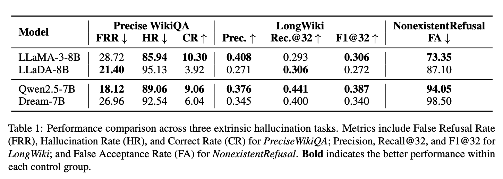

<h1 align="center">Lost in Diffusion</h1>


## Introduction

This project investigates the reliability of Diffusion Large Language Models (dLLMs), with a particular focus on hallucination patterns and diffusion-specific failure modes. Through controlled comparisons with autoregressive baselines matched in architecture, scale, or pretrained weights, we systematically study how diffusion-based generation differs in factual consistency and faithfulness. We further examine the role of inference-time compute under different decoding strategies, showing that while non-sequential denoising enables continuous refinement, current dLLMs remain more prone to hallucination and exhibit distinctive failure modes such as premature termination, incomplete denoising, and context intrusion. We hope this repository provides a clear and reproducible foundation for evaluating, understanding, and improving the reliability of dLLMs.



---


## Repository Layout

This repository combines:

- `HalluLens` for hallucination evaluation,
- diffusion LLM codebases (`Dream`, `LLaDA`, `Fast-dLLM`), and
- autoregressive LLM serving scripts (`AR-LLMs`).

We provide `server.py` compatibility adapters inside dLLM codebases so they can be evaluated through HalluLens with a unified interface.
For projects that provide both base and instruction-tuned checkpoints, we additionally provide `server_instruct.py`.

**Note**: If you aim to reproduce our reported numbers, we strongly recommend using these adapter scripts (`server.py`) only as references and re-implementing the same interfaces with a modern dLLM inference framework (for example, [dInfer](https://github.com/inclusionAI/dInfer)). Our experiments were conducted in parallel with the development of current dLLM serving stacks, so the released adapters prioritize correctness and compatibility over inference speed.

```text
.
├── HalluLens/      # Hallucination benchmark and evaluation pipeline
├── Dream/          # Dream dLLM code + HalluLens adapter servers
├── LLaDA/          # LLaDA dLLM code + HalluLens adapter servers
├── Fast-dLLM/      # Fast-dLLM code + adapter server (v2 and llada paths)
├── LLaDA-2.0/      # Additional local adapter for LLaDA 2.0 style serving
└── AR-LLMs/        # vLLM launcher scripts for AR baselines
```

## Quick Start

### 1) Environment


```bash
python -m venv .venv
source .venv/bin/activate
pip install -U pip
pip install -r HalluLens/requirements.txt
pip install torch transformers fastapi uvicorn pydantic
```

### 2) Prepare HalluLens data

```bash
cd HalluLens
bash scripts/download_data.sh
```

### 3) Start model servers

Run one server per model/checkpoint you want to evaluate.

- AR baselines (vLLM): use scripts in `AR-LLMs/`.
- Dream base/instruct adapters:

```bash
python Dream/server.py
# or
python Dream/server_instruct.py
```

- LLaDA base/instruct adapters:

```bash
python LLaDA/server.py
# or
python LLaDA/server_instruct.py
```

- Fast-dLLM v2 adapter:

```bash
python Fast-dLLM/v2/server.py
```

- LLaDA 2.0 adapter:

```bash
python LLaDA-2.0/server.py
```

### 4) Configure HalluLens endpoint mapping

Check `HalluLens/utils/lm.py`:

- `CUSTOM_SERVER` should point to your serving host.
- `model_map` should match the model names and ports you started.

### 5) Run HalluLens tasks

```bash
cd HalluLens
bash scripts/task1_precisewikiqa.sh
bash scripts/task2_longwiki.sh
bash scripts/task3-1_mixedentities.sh
```

## Citation

```bibtex
@inproceedings{lost_in_diffusion,
  title     = {Lost in Diffusion: Uncovering Hallucination Patterns and Failure Modes in Diffusion Large Language Models},
  author    = {Guo, Zhengnan and Fei, Tan},
  booktitle = {Findings of the Association for Computational Linguistics: ACL 2026},
  year      = {2026},
}
```

## License

This repository includes multiple upstream projects with different licenses.
See [LICENSES.md](LICENSES.md) for the full directory-level license matrix.

## Acknowledgments

This release builds on the excellent open-source efforts from HalluLens, Dream, Fast-dLLM, and LLaDA contributors.
